# 🚀 ASSIXX - Database Setup Guide

**SaaS Platform für Industrieunternehmen**  
*Komplette Anleitung für neue Entwickler*

---

## 📋 Inhaltsverzeichnis

- [🎯 Überblick](#-überblick)
- [⚡ Schnellstart](#-schnellstart)
  - [WSL Ubuntu Automatisch](#wsl-ubuntu-automatisch)
  - [Windows Automatisch](#windows-automatisch)
- [🛠️ Manuelle Installation](#️-manuelle-installation)
  - [WSL Ubuntu Manuell](#wsl-ubuntu-manuell)
  - [Windows Manuell](#windows-manuell)
- [🗄️ Datenbankschema](#️-datenbankschema)
- [👥 Tenant-System](#-tenant-system)
- [🔧 Konfiguration](#-konfiguration)
- [🚦 Erste Schritte](#-erste-schritte)
- [🔍 Problembehandlung](#-problembehandlung)
- [📚 Weitere Ressourcen](#-weitere-ressourcen)

---

## 🎯 Überblick

Assixx ist eine Multi-Tenant SaaS-Plattform für Industrieunternehmen mit folgenden Hauptfunktionen:

### 🏢 Kernfunktionen
- **Multi-Tenant-Architektur** - Mehrere Unternehmen in einer Instanz
- **Mitarbeiterverwaltung** - Umfassende HR-Funktionen
- **Dokumentenmanagement** - Sichere Dokumentenverwaltung
- **Schwarzes Brett** - Interne Kommunikation
- **Kalender-System** - Terminplanung und Events
- **KVP-System** - Kontinuierlicher Verbesserungsprozess
- **Chat-System** - Interne Kommunikation mit Planungsfunktionen
- **Schichtplanung** - Erweiterte Personalplanung

### 🔧 Technologie-Stack
- **Backend**: Node.js, Express.js
- **Datenbank**: MySQL 8.0+ mit Multi-Tenant-Isolation
- **Frontend**: Vanilla JavaScript, Bootstrap 5
- **Authentifizierung**: JWT mit Tenant-Isolation
- **Architektur**: REST API, WebSocket für Echtzeit-Features

---

## ⚡ Schnellstart

### WSL Ubuntu Automatisch

**Voraussetzungen:**
- Windows 10/11 mit WSL2
- Ubuntu 20.04+ in WSL

```bash
# 1. Repository klonen
git clone [YOUR-REPO-URL] Assixx
cd Assixx

# 2. Automatisches Setup ausführen
chmod +x setup-wsl-ubuntu.sh
./setup-wsl-ubuntu.sh

# 3. Anwendung starten
cd server
npm start

# 4. Browser öffnen
# http://localhost:3000/signup.html
```

### Windows Automatisch

**Voraussetzungen:**
- Windows 10/11
- PowerShell als Administrator

```powershell
# 1. PowerShell als Administrator öffnen
# Rechtsklick auf Start > Windows PowerShell (Administrator)

# 2. Repository klonen
git clone [YOUR-REPO-URL] C:\Assixx
cd C:\Assixx

# 3. Automatisches Setup ausführen
.\setup-windows.ps1

# 4. Anwendung starten
cd server
npm start

# 5. Browser öffnen
# http://localhost:3000/signup.html
```

---

## 🛠️ Manuelle Installation

### WSL Ubuntu Manuell

#### 1️⃣ System vorbereiten

```bash
# System aktualisieren
sudo apt update && sudo apt upgrade -y

# Grundlegende Tools installieren
sudo apt install -y curl wget unzip build-essential openssl ca-certificates gnupg lsb-release
```

#### 2️⃣ Node.js installieren

```bash
# NodeSource Repository hinzufügen
curl -fsSL https://deb.nodesource.com/setup_18.x | sudo -E bash -

# Node.js installieren
sudo apt-get install -y nodejs

# Version überprüfen
node --version    # Sollte v18.x.x oder höher sein
npm --version     # Sollte 9.x.x oder höher sein
```

#### 3️⃣ MySQL installieren

```bash
# MySQL Server installieren
sudo apt install -y mysql-server mysql-client

# MySQL starten und aktivieren
sudo systemctl start mysql
sudo systemctl enable mysql

# MySQL sichern (Root-Passwort setzen!)
sudo mysql_secure_installation
# Folgen Sie den Anweisungen:
# - Root-Passwort setzen: JA
# - Anonyme Benutzer entfernen: JA  
# - Root-Remote-Login deaktivieren: JA
# - Test-Datenbank entfernen: JA
# - Privilegien neu laden: JA
```

#### 4️⃣ Git installieren

```bash
# Git installieren
sudo apt install -y git

# Git konfigurieren (optional)
git config --global user.name "Ihr Name"
git config --global user.email "ihre.email@example.com"
```

#### 5️⃣ Projekt einrichten

```bash
# Projekt klonen
git clone [YOUR-REPO-URL] Assixx
cd Assixx

# NPM-Abhängigkeiten installieren
cd server
npm install
cd ..
```

#### 6️⃣ Datenbank einrichten

```bash
# MySQL als Root anmelden
mysql -u root -p

# In MySQL-Konsole ausführen:
```

```sql
-- Datenbank und Benutzer erstellen
CREATE DATABASE assixx_db CHARACTER SET utf8mb4 COLLATE utf8mb4_unicode_ci;
CREATE USER 'assixx_user'@'localhost' IDENTIFIED BY 'IhrSicheresPasswort123!';
GRANT ALL PRIVILEGES ON assixx_db.* TO 'assixx_user'@'localhost';
FLUSH PRIVILEGES;
EXIT;
```

```bash
# Datenbankschema importieren
mysql -u assixx_user -p assixx_db < database-setup.sql
```

#### 7️⃣ .env-Datei konfigurieren

```bash
# .env-Datei erstellen
cp server/.env.example server/.env

# .env-Datei bearbeiten
nano server/.env
```

**Wichtige Einstellungen in `.env`:**

```bash
# Database Configuration
DB_HOST=localhost
DB_USER=assixx_user
DB_PASSWORD=IhrSicheresPasswort123!
DB_NAME=assixx_db

# Security Configuration (neue Secrets generieren!)
JWT_SECRET=$(openssl rand -base64 64)
SESSION_SECRET=$(openssl rand -base64 64)
ENCRYPTION_KEY=$(openssl rand -hex 64)
```

#### 8️⃣ Firewall konfigurieren

```bash
# Port 3000 öffnen
sudo ufw allow 3000/tcp
sudo ufw --force enable
```

#### 9️⃣ Anwendung starten

```bash
# Entwicklungsmodus
cd server
npm start

# Oder Produktionsmodus
NODE_ENV=production npm start
```

---

### Windows Manuell

#### 1️⃣ Chocolatey installieren

```powershell
# PowerShell als Administrator öffnen
# Execution Policy setzen
Set-ExecutionPolicy Bypass -Scope Process -Force

# Chocolatey installieren
[System.Net.ServicePointManager]::SecurityProtocol = [System.Net.ServicePointManager]::SecurityProtocol -bor 3072
iex ((New-Object System.Net.WebClient).DownloadString('https://community.chocolatey.org/install.ps1'))

# PowerShell neustarten oder Pfad aktualisieren
refreshenv
```

#### 2️⃣ Software installieren

```powershell
# Node.js installieren
choco install nodejs -y

# Git installieren
choco install git -y

# MySQL installieren
choco install mysql -y

# PowerShell neustarten
refreshenv
```

#### 3️⃣ MySQL konfigurieren

```powershell
# MySQL-Service starten
Start-Service MySQL
Set-Service MySQL -StartupType Automatic

# MySQL Root-Passwort setzen
mysql -u root -e "ALTER USER 'root'@'localhost' IDENTIFIED BY 'IhrRootPasswort123!';"
```

#### 4️⃣ Projekt einrichten

```powershell
# Projekt klonen
git clone [YOUR-REPO-URL] C:\Assixx
cd C:\Assixx

# NPM-Abhängigkeiten installieren
cd server
npm install
cd ..
```

#### 5️⃣ Datenbank einrichten

```powershell
# MySQL-Konsole öffnen
mysql -u root -p
```

```sql
-- Datenbank und Benutzer erstellen
CREATE DATABASE assixx_db CHARACTER SET utf8mb4 COLLATE utf8mb4_unicode_ci;
CREATE USER 'assixx_user'@'localhost' IDENTIFIED BY 'IhrSicheresPasswort123!';
GRANT ALL PRIVILEGES ON assixx_db.* TO 'assixx_user'@'localhost';
FLUSH PRIVILEGES;
EXIT;
```

```powershell
# Datenbankschema importieren
Get-Content database-setup.sql | mysql -u assixx_user -p assixx_db
```

#### 6️⃣ .env-Datei konfigurieren

```powershell
# .env-Datei erstellen
Copy-Item server\.env.example server\.env

# .env-Datei bearbeiten (mit Notepad)
notepad server\.env
```

#### 7️⃣ Firewall konfigurieren

```powershell
# Firewall-Regel für Port 3000 erstellen
New-NetFirewallRule -DisplayName "Assixx Server" -Direction Inbound -Port 3000 -Protocol TCP -Action Allow
```

#### 8️⃣ Anwendung starten

```powershell
# Anwendung starten
cd server
npm start
```

---

## 🗄️ Datenbankschema

### 📊 Schema-Übersicht

Das Assixx-System verwendet **39 Haupttabellen** in 10 Kategorien:

#### 1. **Tenant Management** (3 Tabellen)
- `tenants` - Unternehmensdaten
- `tenant_admins` - Zuordnung Admin → Tenant
- `tenant_subscriptions` - Abonnements

#### 2. **User Management** (4 Tabellen)
- `users` - Alle Benutzer (Root/Admin/Employee)
- `departments` - Abteilungen
- `teams` - Teams
- `user_teams` - Benutzer ↔ Team-Zuordnung

#### 3. **Document Management** (1 Tabelle)
- `documents` - Alle Dokumente mit Kategorisierung

#### 4. **Feature Management** (5 Tabellen)
- `features` - Verfügbare Features
- `tenant_features` - Feature-Aktivierung pro Tenant
- `subscription_plans` - Abo-Pläne
- `plan_features` - Plan ↔ Feature-Zuordnung
- `feature_usage_logs` - Nutzungsstatistiken

#### 5. **Blackboard System** (3 Tabellen)
- `blackboard_entries` - Ankündigungen
- `blackboard_tags` - Tags für Kategorisierung
- `blackboard_confirmations` - Lesebestätigungen

#### 6. **Calendar System** (4 Tabellen)
- `calendar_events` - Termine und Events
- `calendar_attendees` - Teilnehmer
- `calendar_reminders` - Erinnerungen
- `calendar_recurring_rules` - Wiederholungsregeln

#### 7. **KVP System** (6 Tabellen)
- `kvp_categories` - Verbesserungskategorien
- `kvp_suggestions` - Verbesserungsvorschläge
- `kvp_attachments` - Dateianhänge
- `kvp_comments` - Kommentare
- `kvp_ratings` - Bewertungen
- `kvp_points` - Belohnungssystem

#### 8. **Chat System** (6 Tabellen)
- `conversations` - Chat-Räume
- `conversation_participants` - Teilnehmer
- `messages` - Nachrichten mit Planungsfunktion
- `message_attachments` - Dateianhänge
- `chat_permissions` - Berechtigungen
- `work_schedules` - Arbeitszeiten

#### 9. **Shift Planning** (7 Tabellen)
- `shift_templates` - Schichtvorlagen
- `shift_plans` - Schichtpläne
- `shifts` - Einzelne Schichten
- `shift_assignments` - Team-Zuordnungen
- `employee_availability` - Verfügbarkeit
- `overtime_records` - Überstunden
- `absences` - Abwesenheiten

#### 10. **Admin & Audit** (1 Tabelle)
- `admin_logs` - Audit Trail

### 🔗 Wichtige Beziehungen

```mermaid
erDiagram
    tenants ||--o{ users : "hat"
    users ||--o{ departments : "verwaltet"
    departments ||--o{ teams : "enthält"
    users ||--o{ user_teams : "gehört_zu"
    users ||--o{ documents : "besitzt"
    users ||--o{ messages : "sendet"
    tenants ||--o{ tenant_features : "aktiviert"
```



---

## 👥 Tenant-System

### 🏗️ Multi-Tenant-Architektur

Assixx verwendet eine **Shared Database, Shared Schema**-Architektur mit Tenant-Isolation:

#### Tenant-Erstellung via Signup

**WICHTIG:** Es gibt **keinen hardcodierten Root-Benutzer** mehr!

1. **Neues Unternehmen registrieren:**
   ```
   http://localhost:3000/signup.html
   ```

2. **Tenant wird automatisch erstellt:**
   - Neue Zeile in `tenants`-Tabelle
   - Eindeutige `tenant_id` generiert
   - Admin-Benutzer automatisch zugeordnet

3. **Daten-Isolation:**
   - Jede Abfrage filtert nach `tenant_id`
   - JWT-Token enthalten `tenant_id`
   - Middleware prüft Tenant-Zugehörigkeit

#### Tenant-Verwaltung

```sql
-- Neue Tenants anzeigen
SELECT id, company_name, subdomain, status, created_at 
FROM tenants 
ORDER BY created_at DESC;

-- Tenant-Statistiken
SELECT 
    t.company_name,
    COUNT(u.id) as user_count,
    COUNT(d.id) as document_count
FROM tenants t
LEFT JOIN users u ON t.id = u.tenant_id
LEFT JOIN documents d ON t.id = d.tenant_id
GROUP BY t.id, t.company_name;
```

### 🔐 Sicherheitskonzept

- **Tenant-Isolation**: Alle Daten nach `tenant_id` getrennt
- **JWT-Token**: Enthalten `tenant_id` für sichere API-Calls
- **Middleware-Schutz**: Automatische Tenant-Validierung
- **Role-Based Access**: Root → Admin → Employee Hierarchie

---

## 🔧 Konfiguration

### 📄 .env-Datei Template

```bash
# =====================================================
# ASSIXX ENVIRONMENT CONFIGURATION
# =====================================================

# Server Configuration
NODE_ENV=development
PORT=3000

# Database Configuration
DB_HOST=localhost
DB_USER=assixx_user
DB_PASSWORD=IhrSicheresPasswort123!
DB_NAME=assixx_db

# Security Configuration (NEUE SECRETS GENERIEREN!)
JWT_SECRET=IhrJWTSecret64ZeichenLang...
SESSION_SECRET=IhrSessionSecret64ZeichenLang...
ENCRYPTION_KEY=IhrEncryptionKey128ZeichenLang...

# CORS Configuration
ALLOWED_ORIGINS=http://localhost:3000,http://127.0.0.1:3000

# Rate Limiting
RATE_LIMIT_WINDOW_MS=900000
RATE_LIMIT_MAX_REQUESTS=100
RATE_LIMIT_AUTH_MAX=5

# Feature Flags
ENABLE_ENCRYPTION_AT_REST=false
ENABLE_AUDIT_LOGS=true
USE_MOCK_DB=false

# Email Configuration (optional)
SMTP_HOST=
SMTP_PORT=587
SMTP_USER=
SMTP_PASSWORD=
EMAIL_FROM=noreply@assixx.com

# Logging Configuration
LOG_LEVEL=info
LOG_FILE=combined.log

# File Upload Configuration
MAX_FILE_SIZE=10485760  # 10MB
UPLOAD_PATH=./uploads
ALLOWED_FILE_TYPES=pdf,jpg,jpeg,png,doc,docx,xls,xlsx
```

### 🔐 Sicherheits-Secrets generieren

#### Linux/WSL:
```bash
# JWT Secret (64 Zeichen)
openssl rand -base64 64

# Session Secret (64 Zeichen)  
openssl rand -base64 64

# Encryption Key (128 Zeichen Hex)
openssl rand -hex 64
```

#### Windows PowerShell:
```powershell
# Zufällige Secrets generieren
-join ((1..64) | ForEach {[char](Get-Random -Min 48 -Max 123)})
```

### 🗂️ Verzeichnisstruktur

```
Assixx/
├── database-setup.sql          # Komplettes DB-Schema
├── setup-wsl-ubuntu.sh        # Automatisches WSL Setup
├── setup-windows.ps1          # Automatisches Windows Setup
├── DATABASE-SETUP-README.md   # Diese Anleitung
├── README.md                   # Projekt-Übersicht
├── CLAUDE.md                   # Entwickler-Dokumentation
└── server/
    ├── .env                    # Umgebungsvariablen
    ├── .env.example           # Template
    ├── package.json           # NPM-Abhängigkeiten
    ├── index.js              # Hauptserver
    ├── database.js           # DB-Verbindung
    ├── models/               # Datenmodelle
    ├── routes/               # API-Routen
    ├── middleware/           # Express-Middleware
    ├── public/               # Frontend-Dateien
    ├── uploads/              # Hochgeladene Dateien
    └── utils/                # Hilfsfunktionen
```

---

## 🚦 Erste Schritte

### 1️⃣ Erstes Unternehmen erstellen

1. **Anwendung starten:**
   ```bash
   cd server
   npm start
   ```

2. **Signup-Seite öffnen:**
   ```
   http://localhost:3000/signup.html
   ```

3. **Unternehmensdaten eingeben:**
   - Firmenname
   - E-Mail-Adresse
   - Subdomain (eindeutig)
   - Admin-Benutzerdaten

### 2️⃣ System konfigurieren

1. **Als Admin anmelden:**
   ```
   http://localhost:3000/login.html
   ```

2. **Abteilungen erstellen:**
   - Admin Dashboard → Organisationsverwaltung
   - Neue Abteilung anlegen
   - Manager zuweisen

3. **Teams erstellen:**
   - Teams innerhalb von Abteilungen
   - Teamleiter bestimmen

4. **Mitarbeiter hinzufügen:**
   - Employee Dashboard → Mitarbeiter
   - Neuen Mitarbeiter erstellen
   - Abteilung und Team zuweisen

### 3️⃣ Features aktivieren

1. **Feature-Management:**
   ```
   http://localhost:3000/feature-management.html
   ```

2. **Standard-Features aktivieren:**
   - Blackboard System
   - Calendar System
   - Document Management
   - Chat System (Premium)
   - KVP System (Premium)

### 4️⃣ Benutzerrollen verstehen

| Rolle | Berechtigung | Funktionen |
|-------|-------------|------------|
| **Root** | Systemweit | Tenant-Verwaltung, Feature-Management |
| **Admin** | Tenant-weit | Mitarbeiterverwaltung, Konfiguration |
| **Employee** | Begrenzt | Eigene Daten, Dokumentenzugriff |

---

## 🔍 Problembehandlung

### ❌ Häufige Probleme

#### 🔴 MySQL-Verbindungsfehler

**Problem:** `Error: connect ECONNREFUSED 127.0.0.1:3306`

**Lösung:**
```bash
# MySQL-Status prüfen
sudo systemctl status mysql

# MySQL starten
sudo systemctl start mysql

# MySQL-Konfiguration prüfen
mysql -u root -p -e "SHOW DATABASES;"
```

#### 🔴 .env-Datei nicht gefunden

**Problem:** `TypeError: Cannot read properties of undefined`

**Lösung:**
```bash
# .env-Datei erstellen
cp server/.env.example server/.env

# Datenbankeinstellungen prüfen
cat server/.env | grep DB_
```

#### 🔴 Port bereits in Verwendung

**Problem:** `Error: listen EADDRINUSE :::3000`

**Lösung:**
```bash
# Prozess auf Port 3000 finden
sudo lsof -i :3000

# Prozess beenden
sudo kill -9 <PID>

# Anderen Port verwenden
PORT=3001 npm start
```

#### 🔴 NPM-Abhängigkeiten fehlen

**Problem:** `Module not found`

**Lösung:**
```bash
# NPM-Cache löschen
npm cache clean --force

# node_modules löschen und neu installieren
rm -rf node_modules package-lock.json
npm install
```

#### 🔴 MySQL Root-Passwort vergessen

**Lösung für Ubuntu/WSL:**
```bash
# MySQL sicher stoppen
sudo systemctl stop mysql

# MySQL im Skip-Grant-Modus starten
sudo mysqld_safe --skip-grant-tables &

# Als Root anmelden (ohne Passwort)
mysql -u root

# Passwort zurücksetzen
ALTER USER 'root'@'localhost' IDENTIFIED BY 'NeuesPasswort123!';
FLUSH PRIVILEGES;
EXIT;

# MySQL normal neustarten
sudo systemctl restart mysql
```

### 🔧 Debug-Modus

```bash
# Debug-Logging aktivieren
LOG_LEVEL=debug npm start

# Datenbankverbindung testen
node test-db-connection.js

# API-Endpunkte testen
curl http://localhost:3000/api/health
```

### 📊 Systemüberwachung

```bash
# Laufende Node-Prozesse
ps aux | grep node

# Speicherverbrauch
free -h

# Festplattenspeicher
df -h

# MySQL-Prozesse
sudo systemctl status mysql
```

---

## 📚 Weitere Ressourcen

### 📖 Dokumentation

- **[CLAUDE.md](./CLAUDE.md)** - Entwickler-Dokumentation
- **[ROADMAP.md](./ROADMAP.md)** - Geplante Features
- **[API-Dokumentation](./server/API-TEST-README.md)** - REST API Reference

### 🛠️ Entwickler-Tools

```bash
# Code-Formatierung
npm run format

# Tests ausführen
npm test

# Code-Qualität prüfen
npm run lint

# Build für Produktion
npm run build
```

### 🔗 Nützliche Links

- **Node.js**: https://nodejs.org/
- **MySQL**: https://dev.mysql.com/doc/
- **Express.js**: https://expressjs.com/
- **Bootstrap**: https://getbootstrap.com/
- **JWT.io**: https://jwt.io/

### 🆘 Support

Bei Problemen:

1. **Log-Dateien prüfen:** `server/combined.log`
2. **GitHub Issues:** [Projekt-Repository]/issues
3. **Dokumentation:** Siehe CLAUDE.md
4. **Community:** [Community-Link]

---

## ✅ Checkliste für neue Entwickler

- [ ] ✅ WSL/Windows vorbereitet
- [ ] ✅ Node.js installiert (v18+)
- [ ] ✅ MySQL installiert und konfiguriert
- [ ] ✅ Git installiert
- [ ] ✅ Projekt geklont
- [ ] ✅ NPM-Abhängigkeiten installiert
- [ ] ✅ Datenbank erstellt
- [ ] ✅ Schema importiert
- [ ] ✅ .env-Datei konfiguriert
- [ ] ✅ Anwendung startet erfolgreich
- [ ] ✅ Erstes Unternehmen erstellt
- [ ] ✅ Als Admin angemeldet
- [ ] ✅ Abteilungen und Teams eingerichtet
- [ ] ✅ Erste Mitarbeiter hinzugefügt

---

**🎉 Herzlichen Glückwunsch! Assixx ist jetzt einsatzbereit!**

*Generiert am: $(date)*  
*Version: 2025-01-23*