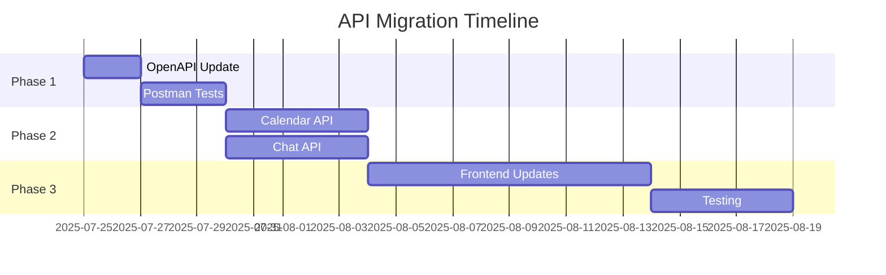

# 🎯 API Design Workshop Plan

## Workshop Ziel

Eine einheitliche, dokumentierte API-Struktur für Assixx etablieren

## Teilnehmer (empfohlen)

- [ ] Frontend Lead Developer
- [ ] Backend Lead Developer
- [ ] Product Owner
- [ ] QA/Test Lead
- [ ] DevOps Engineer
- [ ] Optional: CTO/Tech Lead

## Vorbereitung (vor dem Workshop)

### 1. Dokumentation sammeln (✅ Erledigt)

- [x] Aktuelle OpenAPI Spec exportiert
- [x] Test-Erwartungen dokumentiert
- [x] Mismatches identifiziert
- [ ] Frontend API-Calls analysieren
- [ ] Production Logs checken

### 2. Tools vorbereiten

```bash
# Swagger UI läuft auf:
http://localhost:3000/api-docs/

# OpenAPI JSON:
http://localhost:3000/api-docs/swagger.json

# Postman importieren:
curl http://localhost:3000/api-docs/swagger.json -o assixx-api.json
```

## Workshop Agenda (4-6 Stunden)

### Phase 1: IST-Analyse (1h)

1. **Swagger UI Review** (30min)
   - Gemeinsam durch alle Endpoints gehen
   - Inkonsistenzen notieren
   - Fehlende Endpoints identifizieren

2. **Test vs Reality** (30min)
   - API-MISMATCHES.md durchgehen
   - Gründe für Abweichungen klären
   - Historie verstehen

### Phase 2: API Standards definieren (1.5h)

#### Naming Conventions

```yaml
# Vorschlag REST Best Practices:
Resources:
  - Plural: /users, /departments, /teams
  - Nested: /departments/:id/teams
  - Actions: POST /users/:id/activate

Response Format:
  Success:
    success: true
    data: {} oder []
    meta: { pagination, etc }

  Error:
    success: false
    error: {
      code: "VALIDATION_ERROR"
      message: "Readable message"
      details: []
    }

Validation Errors:
  - field (nicht path)
  - message
  - value (optional)
```

#### Beispiel Standardisierung:

```javascript
// Calendar Events
GET    /api/calendar/events          // List all
POST   /api/calendar/events          // Create
GET    /api/calendar/events/:id      // Get one
PUT    /api/calendar/events/:id      // Update
DELETE /api/calendar/events/:id      // Delete

// Calendar Availability (neu)
GET    /api/calendar/availability
POST   /api/calendar/availability/check

// Chat (Conversations statt Channels)
GET    /api/chat/conversations
POST   /api/chat/conversations
GET    /api/chat/conversations/:id
DELETE /api/chat/conversations/:id

// Messages als Sub-Resource
GET    /api/chat/conversations/:id/messages
POST   /api/chat/conversations/:id/messages
PUT    /api/chat/messages/:id         // Direkt für Edit
DELETE /api/chat/messages/:id         // Direkt für Delete
```

### Phase 3: Entscheidungen treffen (1.5h)

#### Für jeden Endpoint entscheiden:

1. **Keep** - Bleibt wie es ist
2. **Deprecate** - Auslaufen lassen
3. **Change** - Breaking Change
4. **Add** - Neuer Endpoint

#### Beispiel Decision Matrix:

| Endpoint | Current             | Proposed         | Decision | Migration |
| -------- | ------------------- | ---------------- | -------- | --------- |
| Calendar | /calendar           | /calendar/events | ???      | ???       |
| Chat     | /chat/conversations | Keep as is       | ???      | ???       |

### Phase 4: Implementation Plan (1h)

#### Prioritäten:

1. **Critical** - Blockt Features
2. **High** - Wichtig für UX
3. **Medium** - Nice to have
4. **Low** - Kann warten

#### Timeline:



### Phase 5: Tooling Setup (1h)

1. **Postman Workspace**
   - Collection aus OpenAPI
   - Environment Variables
   - Automated Tests

2. **CI/CD Integration**

   ```yaml
   # .github/workflows/api-tests.yml
   - name: Run API Tests
     run: |
       newman run assixx-api.postman_collection.json \
         -e production.postman_environment.json \
         --reporters cli,junit
   ```

3. **API Versioning Strategy**
   - Header: `X-API-Version: 1`
   - oder URL: `/api/v1/calendar`

## Nach dem Workshop

### Deliverables:

1. [ ] Finalisierte OpenAPI 3.0 Spec
2. [ ] Migration Guide für Frontend
3. [ ] Postman Collection
4. [ ] API Changelog
5. [ ] Timeline mit Milestones

### Communication:

```markdown
# An alle Entwickler

## API Changes Coming

Wir standardisieren unsere API...

### Was ändert sich:

- ...

### Timeline:

- ...

### Migration Guide:

- Link zu Dokumentation
```

## Best Practices für die Zukunft

1. **API-First Development**
   - Erst OpenAPI Spec
   - Dann Implementation
   - Tests aus Spec generieren

2. **Contract Testing**
   - Postman/Newman in CI/CD
   - Breaking Change Detection
3. **Versioning**
   - Semantic Versioning
   - Deprecation Notices
4. **Documentation**
   - Swagger immer aktuell
   - Changelog pflegen
   - Migration Guides

---

## 🚀 Quick Start für Workshop:

```bash
# 1. Swagger UI öffnen
open http://localhost:3000/api-docs/

# 2. Postman importieren
curl http://localhost:3000/api-docs/swagger.json -o assixx-api.json

# 3. Miro/Whiteboard vorbereiten
# Template: API Endpoint Matrix

# 4. Screen teilen und los!
```

**Tipp:** Einen Moderator bestimmen, der dokumentiert und Zeit im Auge behält!
